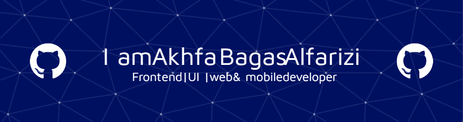

## Hi there! I'm Akhfa Bagas Alfarizi

<!-- **Akhfabgss/akhfabgss** is a ✨ _special_ ✨ repository because its `README.md` (this file) appears on your GitHub profile.

Here are some ideas to get you started: 

- 👯 I’m looking to collaborate on ...
- 🤔 I’m looking for help with ...
- 💬 Ask me about ...
- 📫 How to reach me: ...
- 😄 Pronouns: ...
- ⚡ Fun fact: ...-->\

- 🔭 I’m currently a student at **@ipbofficial** vocational school.
- 🌱 I’m currently learning [**ReactJs**](https://react.dev/) Framework

##### Skills

##### Connect with Me

###### My Github Stats

 
 

##### Dev Quote

<h2 align="left">Play ga,es with me </h2>

###

<picture>
  <source media="(prefers-color-scheme: dark)" srcset="https://raw.githubusercontent.com/akhfabgss/akhfabgss/output/pacman-contribution-graph-dark.svg">
  <source media="(prefers-color-scheme: light)" srcset="https://raw.githubusercontent.com/akhfabgss/akhfabgss/output/pacman-contribution-graph.svg">
  
</picture>

###
